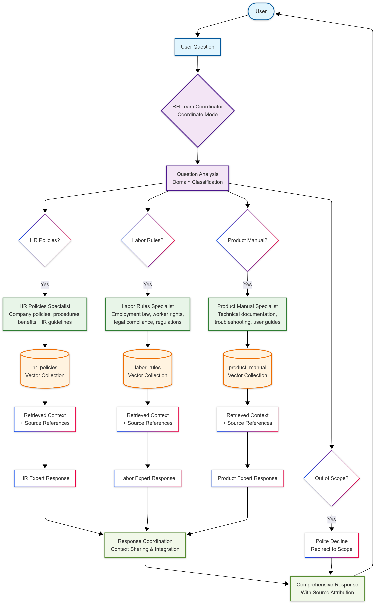

# Multi-Agent Q&A System

[ro-anderson](https://github.com/ro-anderson) | [LinkedIn](https://www.linkedin.com/in/ro-anderson/)


[Watch the code walkthroug video demo here](https://youtu.be/Vx55d1PtAPY?si=yjCRi6-_zTkPQAwn)

### Multi-Agent RAG System QA graph



## Context, Target Users, and Outcomes

### Context
This system addresses the common challenge organizations face when employees, managers, and stakeholders need quick access to accurate information scattered across multiple document types. Instead of manually searching through HR policies, labor regulations, and product manuals, users can ask natural language questions and receive instant, contextual answers with source references.

### Target Users
- **HR Professionals**: Quick access to policy interpretations, compliance requirements, and employee procedure guidance
- **Managers and Team Leaders**: Instant answers about labor laws, employee rights, and company policies for decision-making
- **Employees**: Self-service access to HR policies, benefits information, and product documentation
- **Compliance Officers**: Fast lookup of legal requirements and regulatory compliance information
- **IT Support Teams**: Product documentation and troubleshooting assistance
- **Customer Service**: Product manual information for customer inquiries

### Measurable Outcomes
- **Reduced Response Time**: From hours/days of manual document searching to seconds of AI-powered answers
- **Improved Accuracy**: Source-referenced responses eliminate guesswork and ensure policy compliance
- **Increased Self-Service**: Reduction in routine HR and IT support tickets
- **Enhanced Productivity**: Managers spend less time on information lookup, more time on strategic tasks
- **Better Compliance**: Consistent, accurate interpretation of labor laws and company policies
- **Knowledge Accessibility**: More availability of institutional knowledge without human intervention
- **Cost Reduction**: Decreased dependency on specialized staff for routine information requests

## System Architecture

```
.
├── batch_embedder/           # Document Processing Service
│   └── app/
│       ├── core/             # Core configuration and logging
│       ├── embeddings/       # Embedding generation (see embeddings/README.md)
│       ├── vectordb/         # Vector database operations
│       └── main.py           # Entry point
├── chat_cli/                 # Multi-Agent Chat Service  
│   └── app/
│       ├── core/             # Core configuration and logging
│       ├── agents/           # Specialized AI agents (see agents/README.md)
│       ├── teams/            # Multi-agent coordinators
│       └── main.py           # Chat interface entry point
├── data/                     # Document storage
│   ├── hr-policies/          # HR policy documents
│   ├── labor-rules/          # Labor rule documents  
│   └── product-manual/       # Product manual documents
├── docker-compose.yml        # Docker services orchestration
├── Dockerfile               # Container definitions
├── Makefile                 # Convenient commands
├── pyproject.toml           # Python dependencies
└── .env.example             # Environment variables template
```

## Specialized AI Agents

The system includes three specialized agents that work together:

- **HR Policies Agent**: Company policies, employee procedures, benefits, HR guidelines
- **Labor Rules Agent**: Employment law, worker rights, legal compliance, labor regulations  
- **Product Manual Agent**: Product documentation, technical support, installation guides, troubleshooting

> **For detailed information about the AI agents**, see [`chat_cli/app/agents/README.md`](chat_cli/app/agents/README.md)

## Prerequisites

- **Docker & Docker Compose**: Required for running the containerized services
- **OpenAI API Key**: For embedding generation and chat completion

## Setup

### 1. Environment Configuration

1. **Copy the environment template**:
   ```bash
   cp .env.example .env
   ```

2. **Edit `.env` file** and add your OpenAI API key:
   ```bash
   OPENAI_API_KEY=
   EMBEDDING_MODEL=text-embedding-3-small
   # Qdrant Configuration
   QDRANT_URL=http://localhost:6333
   # Data Configuration
   DATA_PATH=./data
   # Chunking Configuration
   CHUNK_SIZE=300
   CHUNK_OVERLAP=20
   ```

### 2. Add Your Documents

Place your documents in the appropriate folders:
- `data/hr-policies/` - HR policy documents (.md files)
- `data/labor-rules/` - Labor rule documents (.md files)
- `data/product-manual/` - Product manual documents (.md files)

### 3. Explore Vector Database (Optional)

You can start the vector database independently to explore the dashboard:
```bash
docker compose up qdrant
```

Access the Qdrant dashboard at: `http://localhost:6333/dashboard`

**Note**: Initially, the dashboard will be empty with no collections. Collections will only appear after running the embedding pipeline in Step 1 of the usage workflow.

### Step 1: Process Documents (Required First)

```bash
# Start Qdrant vector database
make build

# Process all documents and create embeddings
make run-embedder
```

The `make run-embedder` command will run the embedding system that:
1. Start Qdrant vector database
2. Read all markdown files from `data/` folders
3. Create embeddings using OpenAI  
4. Store vectors in Qdrant collections
5. Verify collections were created successfully

**Before Processing**: The Qdrant dashboard at `http://localhost:6333/dashboard` will be empty with no collections.

**After Processing**: You'll see three collections created based on your document folders.

**Collections Created:**
The system will create three collections in Qdrant based on the folder structure:
- `hr_policies` - From files in `data/hr-policies/`
- `labor_rules` - From files in `data/labor-rules/`
- `product_manual` - From files in `data/product-manual/`

**Current Default Files:**
By default, the system will process these sample files:
```
data/
├── hr-policies/
│   ├── employee_handbook.md
│   └── hr_rewards.md
├── labor-rules/
│   ├── labor_rules_reference.md
│   └── overtime_guideline.md
└── product-manual/
    ├── employee_self_service_portal.md
    └── mobile_app_guide.md
```

**Adding Your Own Files:**
You can add more markdown (.md) files to any of these folders:
- Add HR policy documents to `data/hr-policies/`
- Add labor rule documents to `data/labor-rules/`
- Add product manual documents to `data/product-manual/`

After adding new files, simply run `make run-embedder` again to process them.

### Step 2: Start Interactive Chat

```bash
# Launch the multi-agent chat interface
make run-chat-cli
```

This will:
1. Start the interactive chat interface
2. Initialize all three specialized agents
3. Enable intelligent question routing
4. Provide real-time responses with source references

## Chat Interface Examples

**HR Policy Questions:**
```
Your question: What's our vacation policy?
→ Routes to HR Policies Agent
```

**Labor Law Questions:**
```  
Your question: What are or overtime regulations?
→ Routes to Labor Rules Agent
```

**Product Questions:**
```
What are the exact steps I need to follow the first time I log in to the DigitalBank mobile app?
→ Routes to Product Manual Agent
```

**Out-of-scope Questions:**
```
Your question: What's the weather today?
→ Politely declines and suggests relevant topics
```

## Available Commands

| Command | Description |
|---------|-------------|
| `make build` | Build all Docker images |
| `make run-embedder` | Process documents and create embeddings |
| `make run-chat-cli` | Start interactive chat interface |
| `make run-embedder-debug` | Debug the embedding service |
| `make run-chat-cli-debug` | Debug the chat service |
| `make clean` | Remove Python cache files |
| `make docker-clean` | Clean up Docker containers and volumes |
| `make help` | Show all available commands |

## Monitoring & Debugging

### Qdrant Dashboard
Access the vector database interface at: `http://localhost:6333/dashboard`

**Run Vector Database Only:**
```bash
# Start just the vector database service
docker compose up qdrant
```

**Dashboard States:**
- **Before Embeddings**: Empty dashboard with no collections
- **After Embeddings**: Three collections visible with document vectors

### Service Logs
```bash
# View embedding service logs
docker compose logs batch_embedder

# View chat service logs  
docker compose logs chat_cli

# View Qdrant logs
docker compose logs qdrant
```

### Collections Created
The system creates three collections in Qdrant:
- `hr_policies` - HR policy embeddings
- `labor_rules` - Labor rule embeddings
- `product_manual` - Product manual embeddings

## Features

- **Multi-Agent Coordination**: Intelligent routing to specialized agents
- **OpenAI Integration**: High-quality embeddings and chat completion
- **Semantic Search**: Vector similarity search with Qdrant
- **Interactive Chat**: Beautiful console interface with streaming responses
- **Context Awareness**: Maintains conversation history
- **Scope Management**: Politely handles out-of-scope questions
- **Fully Dockerized**: Complete containerization with Docker Compose
- **Source References**: Provides document references for answers

## Troubleshooting

### Common Issues

1. **OpenAI API Key Error**: Ensure your API key is correctly set in `.env`
2. **No Collections Found**: Run the embedding pipeline first (`make run-embedder`)
3. **Qdrant Connection Error**: Make sure Qdrant service is running
4. **Chat Not Interactive**: Use `make run-chat-cli` (not `docker compose up`)
5. **No Documents Found**: Check that .md files exist in data folders

### Reset Everything
```bash
# Clean up and start fresh
make docker-clean
make build
make run-embedder
make run-chat-cli
```

## Additional Documentation

- **Embedding Service Details**: [`batch_embedder/app/embeddings/README.md`](batch_embedder/app/embeddings/README.md)
- **AI Agents Documentation**: [`chat_cli/app/agents/README.md`](chat_cli/app/agents/README.md)
- **Chat CLI Service**: [`chat_cli/README.md`](chat_cli/README.md)

## Development Workflow

1. **Add new documents** to appropriate `data/` folders
2. **Run embedding pipeline** to process new documents
3. **Test with chat interface** to verify functionality
4. **Monitor via Qdrant dashboard** for vector storage verification

## Next Steps

### Document Management
- Add new document types by creating folders in `data/`
- Extend with new specialized agents for different domains
- Implement document versioning and change detection

### Production API Integration
- **FastAPI Service**: Create a new `api` service to expose agents via REST endpoints
- **Session Management**: Add memory and conversation history storage for user sessions
- **User Authentication**: Implement user management and access control
- **Session Persistence**: Store and retrieve user conversation history across sessions

### Performance & Monitoring
- **Observability**: Integrate monitoring solutions like Logfire or LangFuse for:
  - Agent performance tracking
  - Response quality metrics
  - Usage analytics and cost monitoring
  - Conversation flow analysis
- **Caching Strategy**: Implement function call caching to reduce API costs and improve response times
- **Load Balancing**: Add horizontal scaling for high-traffic scenarios

### Advanced Capabilities
- **Tool Integration**: Expand agent capabilities with external tools:
  - Database connectors for real-time data queries
  - Calendar integration for scheduling-related questions
  - Email systems for notification workflows
  - External API integrations (weather, stock prices, etc.)
- **Multi-modal Support**: Add support for PDF, Word documents, and image processing
- **Advanced RAG**: Implement hybrid search (semantic + keyword), re-ranking, and query expansion

### Quality Assurance & Evaluation
- **Evaluation Framework**: Create systematic agent evaluation with:
  - Validation database with question-answer pairs
  - Automated testing pipeline for response quality
  - A/B testing for different agent configurations
  - Performance benchmarking against human baselines
- **Continuous Improvement**: Implement feedback loops to:
  - Collect user satisfaction ratings
  - Identify knowledge gaps and improve documentation
  - Monitor accuracy and update agent instructions

### Integration & Deployment
- **Web Interface**: Build modern React/Vue.js frontend for browser access
- **Mobile Applications**: Native mobile apps for iOS/Android
- **Enterprise Integrations**: Connect with Slack, Microsoft Teams, or internal chat systems
- **CI/CD Pipeline**: Automated testing, deployment, and monitoring workflows
