# Multi-Agent Document Q&A System Architecture

```mermaid
flowchart TD
    User([👤 User]) --> Input[📝 User Question]
    
    Input --> Coordinator{🎯 RH Team Coordinator<br/>Coordinate Mode}
    
    Coordinator --> Analysis[🔍 Question Analysis<br/>Domain Classification]
    
    Analysis --> HR_Check{HR Policies?}
    Analysis --> Labor_Check{Labor Rules?}
    Analysis --> Product_Check{Product Manual?}
    Analysis --> Scope_Check{Out of Scope?}
    
    HR_Check -->|Yes| HR_Agent[👥 HR Policies Specialist<br/>Company policies, procedures,<br/>benefits, HR guidelines]
    Labor_Check -->|Yes| Labor_Agent[⚖️ Labor Rules Specialist<br/>Employment law, worker rights,<br/>legal compliance, regulations]
    Product_Check -->|Yes| Product_Agent[📖 Product Manual Specialist<br/>Technical documentation,<br/>troubleshooting, user guides]
    
    HR_Agent --> HR_VDB[(🗄️ hr_policies<br/>Vector Collection)]
    Labor_Agent --> Labor_VDB[(🗄️ labor_rules<br/>Vector Collection)]
    Product_Agent --> Product_VDB[(🗄️ product_manual<br/>Vector Collection)]
    
    HR_VDB --> HR_Context[📄 Retrieved Context<br/>+ Source References]
    Labor_VDB --> Labor_Context[📄 Retrieved Context<br/>+ Source References]
    Product_VDB --> Product_Context[📄 Retrieved Context<br/>+ Source References]
    
    HR_Context --> HR_Response[💬 HR Expert Response]
    Labor_Context --> Labor_Response[💬 Labor Expert Response]
    Product_Context --> Product_Response[💬 Product Expert Response]
    
    HR_Response --> Coordination[🤝 Response Coordination<br/>Context Sharing & Integration]
    Labor_Response --> Coordination
    Product_Response --> Coordination
    
    Scope_Check -->|Yes| Decline[❌ Polite Decline<br/>Redirect to Scope]
    
    Coordination --> Final_Response[✅ Comprehensive Response<br/>With Source Attribution]
    Decline --> Final_Response
    
    Final_Response --> User
    
    %% Styling
    classDef userClass fill:#e1f5fe,stroke:#01579b,stroke-width:2px
    classDef coordinatorClass fill:#f3e5f5,stroke:#4a148c,stroke-width:2px
    classDef agentClass fill:#e8f5e8,stroke:#2e7d32,stroke-width:2px
    classDef databaseClass fill:#fff3e0,stroke:#ef6c00,stroke-width:2px
    classDef responseClass fill:#f1f8e9,stroke:#558b2f,stroke-width:2px
    
    class User,Input userClass
    class Coordinator,Analysis coordinatorClass
    class HR_Agent,Labor_Agent,Product_Agent agentClass
    class HR_VDB,Labor_VDB,Product_VDB databaseClass
    class Final_Response,Coordination responseClass
```

## System Flow Description

1. **User Input**: User submits a question through the chat interface
2. **Coordination**: RH Team Coordinator analyzes the question using coordinate mode
3. **Domain Classification**: Determines which specialist(s) can best handle the query
4. **Specialist Consultation**: Routes to appropriate agent(s):
   - HR Policies Specialist for company policy questions
   - Labor Rules Specialist for employment law questions  
   - Product Manual Specialist for technical documentation questions
5. **Vector Search**: Each specialist searches their respective Qdrant collection
6. **Context Retrieval**: Relevant documents and source references are retrieved
7. **Expert Response**: Each consulted specialist generates a domain-specific response
8. **Response Coordination**: Multiple responses are integrated with shared context
9. **Final Output**: Comprehensive answer with source attribution delivered to user

## Key Features Illustrated

- **Multi-Agent Architecture**: Three specialized agents with distinct domains
- **Intelligent Routing**: Automatic question classification and agent selection
- **Vector Database Integration**: Each agent connected to specific document collections
- **Context Sharing**: Agents share interactions for better coordination
- **Source Attribution**: Responses include document references
- **Scope Management**: Out-of-scope questions are handled gracefully
- **Comprehensive Responses**: Multiple agents can collaborate on complex queries 